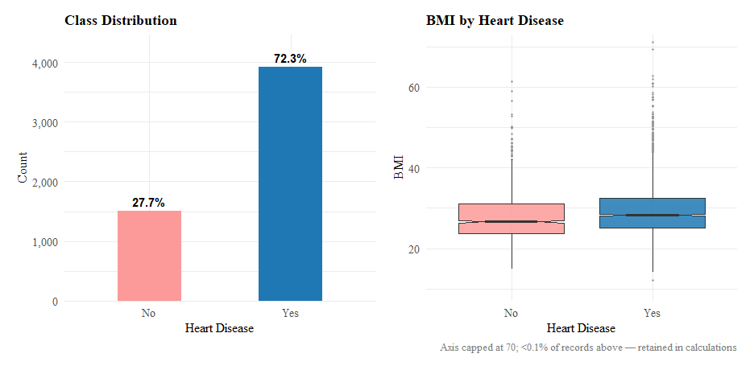
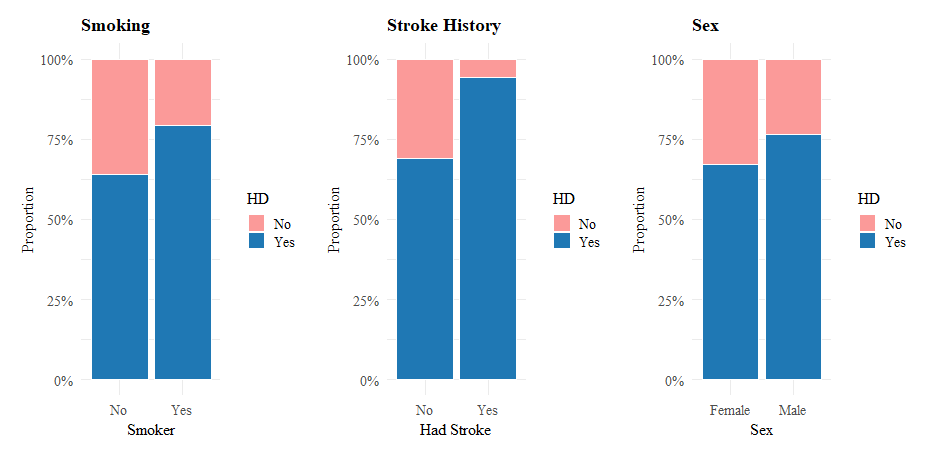
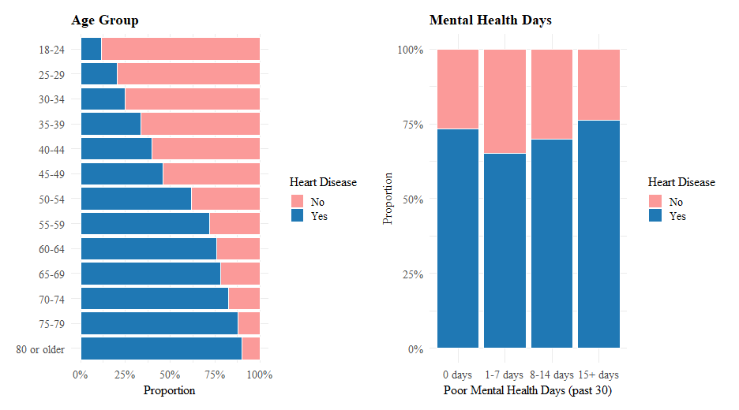
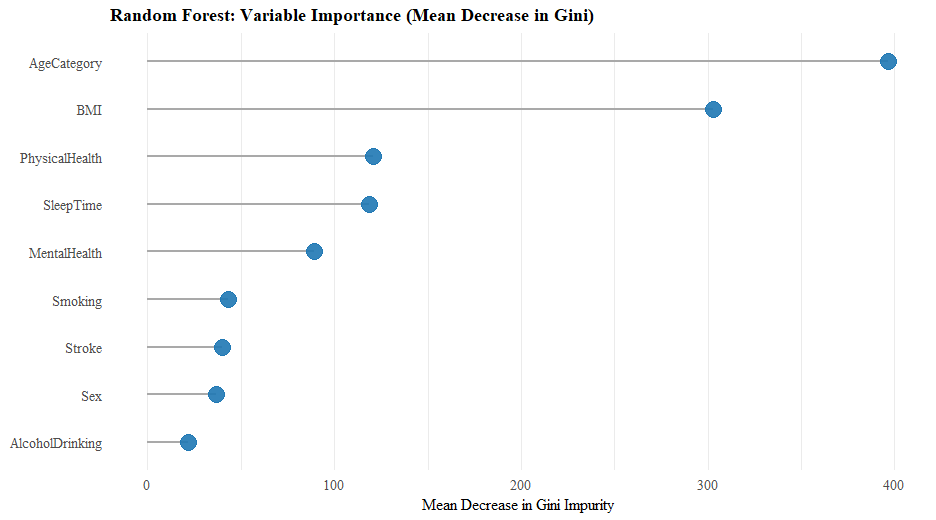
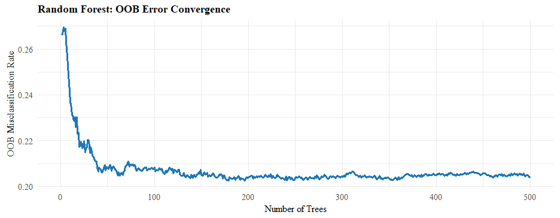
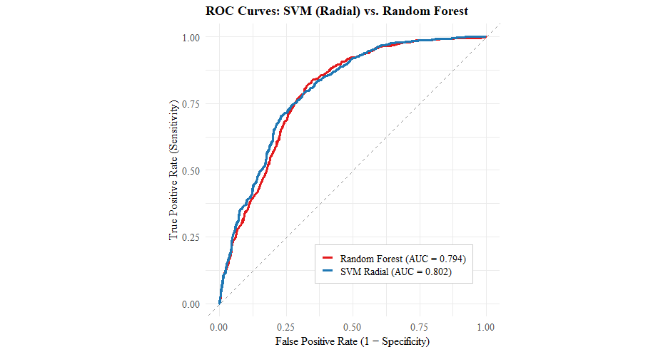

# Heart Disease Risk Prediction: SVM vs Random Forest

Clinical risk prediction project comparing a Support Vector Machine (radial
kernel) against a Random Forest for predicting heart disease from behavioural
and health survey data. Built for MS6022 Statistical Learning at the
University of Limerick.

## What this does

Using a BRFSS-style health survey dataset (demographics, BMI, smoking,
stroke history, physical/mental health days, sleep), the project trains and
compares two classifiers, then asks which one is actually more useful in a
clinical screening context, where catching true cases (sensitivity) matters
more than raw accuracy.

The pipeline:

1. **EDA** — class balance, BMI distributions, and how heart disease risk
   varies across smoking status, stroke history, sex, age group, and mental
   health days.
2. **Data partitioning** — an 80/20 train/test split (3,793 training rows,
   1,627 test rows), with both models trained on the identical training set
   for a fair comparison.
3. **Model 1: SVM (Radial Kernel)** and **Model 2: Random Forest**, both
   evaluated on the same held-out test set.
4. **Evaluation** — accuracy, sensitivity, specificity, and AUC-ROC, benchmarked
   against the naive majority-class baseline.
5. **Interpretation** — Random Forest variable importance (Gini) to identify
   which risk factors drive predictions, plus OOB error convergence to confirm
   the forest was large enough to stabilise.

## Results

The dataset is imbalanced: 72.3% of respondents have no heart disease, so a
naive model that always predicts "No" scores 72.3% accuracy while catching
zero true cases (specificity = 0). Both models comfortably beat that baseline
while actually detecting positive cases.

| Metric | SVM (Radial Kernel) | Random Forest |
|---|---|---|
| Accuracy | **0.8039** | 0.8027 |
| Sensitivity | **0.9413** | 0.9260 |
| Specificity | 0.4457 | **0.4812** |
| AUC-ROC | **0.8021** | 0.7944 |

SVM edges out Random Forest on accuracy, sensitivity, and AUC-ROC, while
Random Forest catches slightly more true negatives (specificity). In a
screening context where missing a real case is costlier than a false alarm,
SVM's higher sensitivity (94.1% of true heart disease cases correctly
flagged) makes it the stronger candidate here, at the cost of a higher false
positive rate.

**What drives the predictions:** Random Forest's variable importance ranks
**age category** as by far the strongest predictor, followed by **BMI**, then
physical health days and sleep time. Smoking, stroke history, sex, and
alcohol use contribute comparatively little once age and BMI are accounted
for.

## Visualisations

**Class distribution and BMI by outcome:**



**Risk by smoking, stroke history, and sex:**



**Risk by age group and mental health days:**



**Random Forest variable importance:**



**Random Forest OOB error convergence** — error stabilises around 20-21%
misclassification after roughly 150-200 trees, confirming 500 trees was more
than sufficient:



**ROC curves, SVM vs Random Forest:**



## Tech stack

R, `e1071` (SVM), `randomForest`, `pROC` or `ROCR` (ROC/AUC), `ggplot2`
(all visualisations), `caret` or base R for train/test partitioning.

## Data

Uses a BRFSS-style (Behavioral Risk Factor Surveillance System) health survey
dataset with demographic and lifestyle features. The raw CSV isn't included
here; to reproduce, place `HeartDiseaseData.csv` in the same folder as the
`.Rmd` file before knitting.

## Running it

```r
install.packages(c("e1071", "randomForest", "pROC", "ggplot2", "caret"))
rmarkdown::render("MS6022_Assignment_Nabeel_Mohammed.Rmd")
```

The full report, including a non-technical summary section, knits to
`MS6022_Assignment_Nabeel_Mohammed.html`.
